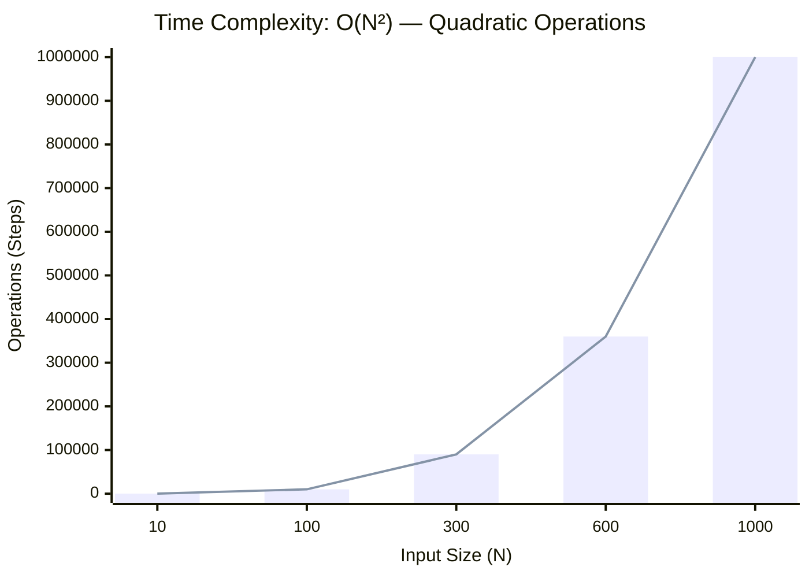
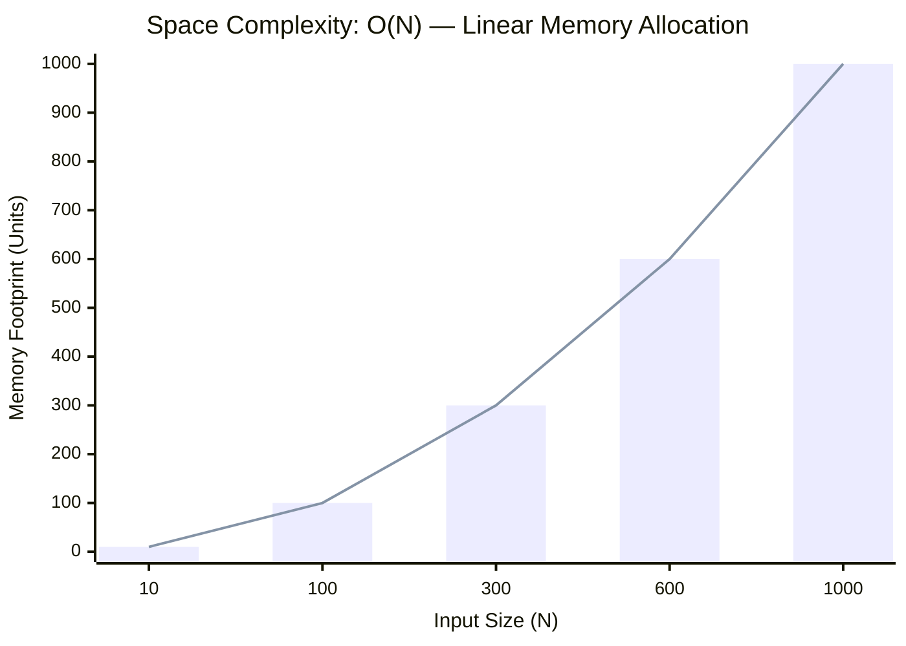

<h2><a href="https://leetcode.com/problems/asteroid-collision/submissions/2163228110/">Asteroid Collision</a></h2><h3>Medium</h3>

We are given an array <code>asteroids</code> of integers representing asteroids in a row. The indices of the asteroid in the array represent their relative position in space.

For each asteroid, the absolute value represents its size, and the sign represents its direction (positive meaning right, negative meaning left). Each asteroid moves at the same speed.

Find out the state of the asteroids after all collisions. If two asteroids meet, the smaller one will explode. If both are the same size, both will explode. Two asteroids moving in the same direction will never meet.

&nbsp;

<strong class="example">Example 1:</strong>

<pre><strong>Input:</strong> asteroids = [5,10,-5]
<strong>Output:</strong> [5,10]
<strong>Explanation:</strong> The 10 and -5 collide resulting in 10. The 5 and 10 never collide.
</pre>

<strong class="example">Example 2:</strong>

<pre><strong>Input:</strong> asteroids = [8,-8]
<strong>Output:</strong> []
<strong>Explanation:</strong> The 8 and -8 collide exploding each other.
</pre>

<strong class="example">Example 3:</strong>

<pre><strong>Input:</strong> asteroids = [10,2,-5]
<strong>Output:</strong> [10]
<strong>Explanation:</strong> The 2 and -5 collide resulting in -5. The 10 and -5 collide resulting in 10.
</pre>

<strong class="example">Example 4:</strong>

<pre><strong>Input:</strong> asteroids = [3,5,-6,2,-1,4]​​​​​​​
<strong>Output:</strong> [-6,2,4]
<strong>Explanation:</strong> The asteroid -6 makes the asteroid 3 and 5 explode, and then continues going left. On the other side, the asteroid 2 destroys -1. Since 2 and 4 are both moving right, they never collide.
</pre>

&nbsp;

<strong>Constraints:</strong>

<ul>
	<li><code>2 &lt;= asteroids.length &lt;= 104</code></li>
	<li><code>-1000 &lt;= asteroids[i] &lt;= 1000</code></li>
	<li><code>asteroids[i] != 0</code></li>
</ul>

### 📊 Submission Statistics
- **Language:** `cpp`
- **Runtime:** `0 ms`
- **Memory:** `N/A`
- **Submission Date:** Mon, 05 Oct 2026 14:39:22 GMT

---

### 💡 Approach & Complexity Analysis
#### 🧠 Intuition & Algorithmic Strategy
- **Approach:** Linear scan and greedy state accumulation to resolve **Asteroid Collision**.
- **Flow:**
  1. Initialize state variables and inspect base constraints.
  2. Iterate through input elements, maintaining current progress and boundaries.
  3. Return the calculated result satisfying problem criteria.

#### ⏱️ Complexity Analysis
- **Time Complexity:** $\mathcal{O}(N^2) \text{ or } \mathcal{O}(N \times M)$ — *Nested iteration processing coordinate pairs, combinations, or 2D matrix grids.*
- **Space Complexity:** $\mathcal{O}(N)$ — *Auxiliary lookup table or dynamically allocated buffer storing input elements.*

#### 📈 Time Complexity Graph (Operations vs Input Size $N$)

#### 📦 Space Complexity Graph (Memory Footprint vs Input Size $N$)

---
*Auto-synced with [LeetGitSyncPro](https://synccode-pro.pages.dev) & [DSATracker](https://dsatracker.in)*
