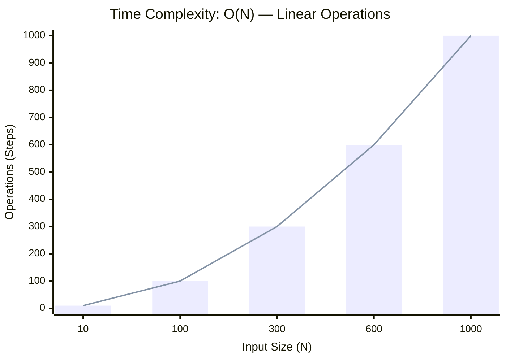
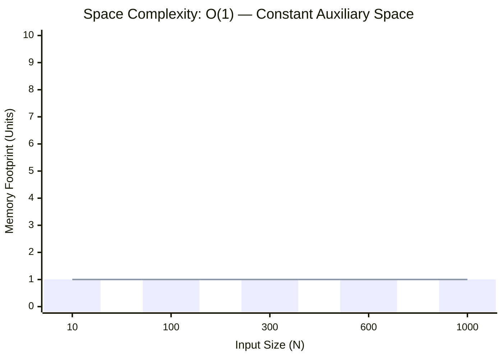

<h2><a href="https://leetcode.com/problems/count-good-numbers/submissions/2163399628/">Count Good Numbers</a></h2><h3>Medium</h3>

A digit string is <strong>good</strong> if the digits <strong>(0-indexed)</strong> at <strong>even</strong> indices are <strong>even</strong> and the digits at <strong>odd</strong> indices are <strong>prime</strong> (<code>2</code>, <code>3</code>, <code>5</code>, or <code>7</code>).

<ul>
	<li>For example, <code>"2582"</code> is good because the digits (<code>2</code> and <code>8</code>) at even positions are even and the digits (<code>5</code> and <code>2</code>) at odd positions are prime. However, <code>"3245"</code> is <strong>not</strong> good because <code>3</code> is at an even index but is not even.</li>
</ul>

Given an integer <code>n</code>, return <em>the <strong>total</strong> number of good digit strings of length </em><code>n</code>. Since the answer may be large, <strong>return it modulo </strong><code>109 + 7</code>.

A <strong>digit string</strong> is a string consisting of digits <code>0</code> through <code>9</code> that may contain leading zeros.

&nbsp;

<strong class="example">Example 1:</strong>

<pre><strong>Input:</strong> n = 1
<strong>Output:</strong> 5
<strong>Explanation:</strong> The good numbers of length 1 are "0", "2", "4", "6", "8".
</pre>

<strong class="example">Example 2:</strong>

<pre><strong>Input:</strong> n = 4
<strong>Output:</strong> 400
</pre>

<strong class="example">Example 3:</strong>

<pre><strong>Input:</strong> n = 50
<strong>Output:</strong> 564908303
</pre>

&nbsp;

<strong>Constraints:</strong>

<ul>
	<li><code>1 &lt;= n &lt;= 1015</code></li>
</ul>

### 📊 Submission Statistics
- **Language:** `cpp`
- **Runtime:** `0 ms`
- **Memory:** `N/A`
- **Submission Date:** Mon, 05 Oct 2026 17:10:16 GMT

---

### 💡 Approach & Complexity Analysis
#### 🧠 Intuition & Algorithmic Strategy
- **Approach:** Linear scan and greedy state accumulation to resolve **Count Good Numbers**.
- **Flow:**
  1. Initialize state variables and inspect base constraints.
  2. Iterate through input elements, maintaining current progress and boundaries.
  3. Return the calculated result satisfying problem criteria.

#### ⏱️ Complexity Analysis
- **Time Complexity:** $\mathcal{O}(N)$ — *Single linear pass over the input collection.*
- **Space Complexity:** $\mathcal{O}(1)$ — *In-place execution using only a constant number of auxiliary pointer variables.*

#### 📈 Time Complexity Graph (Operations vs Input Size $N$)

#### 📦 Space Complexity Graph (Memory Footprint vs Input Size $N$)

---
*Auto-synced with [LeetGitSyncPro](https://synccode-pro.pages.dev) & [DSATracker](https://dsatracker.in)*
