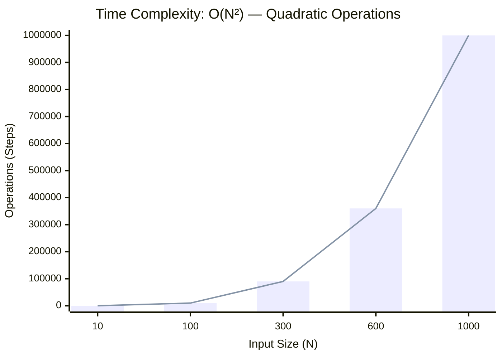
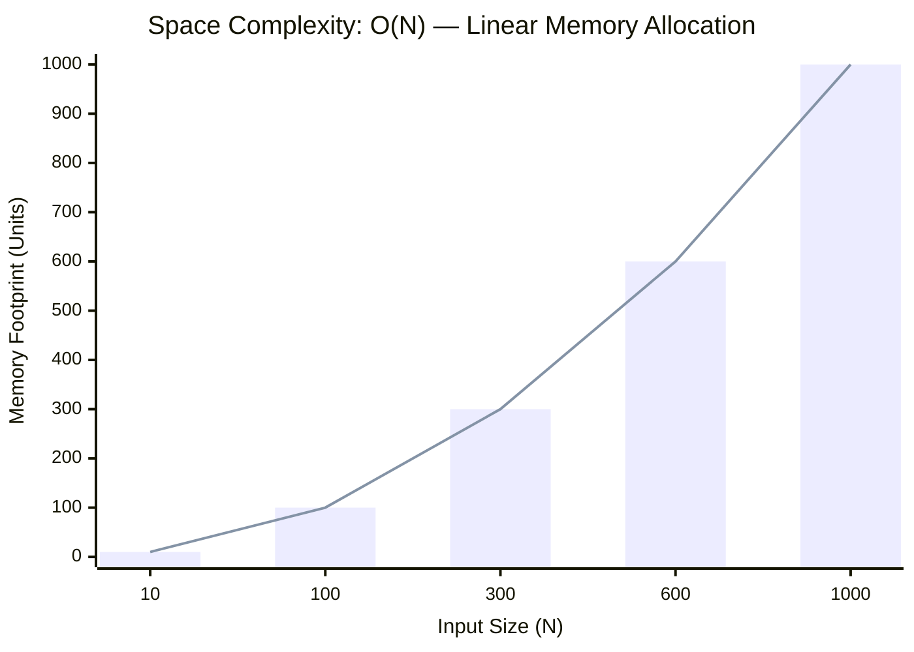

<h2><a href="https://leetcode.com/problems/hand-of-straights/submissions/2162148798/">Hand of Straights</a></h2><h3>Medium</h3>

Alice has some number of cards and she wants to rearrange the cards into groups so that each group is of size <code>groupSize</code>, and consists of <code>groupSize</code> consecutive cards.

Given an integer array <code>hand</code> where <code>hand[i]</code> is the value written on the <code>ith</code> card and an integer <code>groupSize</code>, return <code>true</code> if she can rearrange the cards, or <code>false</code> otherwise.

&nbsp;

<strong class="example">Example 1:</strong>

<pre><strong>Input:</strong> hand = [1,2,3,6,2,3,4,7,8], groupSize = 3
<strong>Output:</strong> true
<strong>Explanation:</strong> Alice's hand can be rearranged as [1,2,3],[2,3,4],[6,7,8]
</pre>

<strong class="example">Example 2:</strong>

<pre><strong>Input:</strong> hand = [1,2,3,4,5], groupSize = 4
<strong>Output:</strong> false
<strong>Explanation:</strong> Alice's hand can not be rearranged into groups of 4.

</pre>

&nbsp;

<strong>Constraints:</strong>

<ul>
	<li><code>1 &lt;= hand.length &lt;= 104</code></li>
	<li><code>0 &lt;= hand[i] &lt;= 109</code></li>
	<li><code>1 &lt;= groupSize &lt;= hand.length</code></li>
</ul>

&nbsp;

<strong>Note:</strong> This question is the same as 1296: <a href="https://leetcode.com/problems/divide-array-in-sets-of-k-consecutive-numbers/" target="_blank">https://leetcode.com/problems/divide-array-in-sets-of-k-consecutive-numbers/</a>

### 📊 Submission Statistics
- **Language:** `cpp`
- **Runtime:** `0 ms`
- **Memory:** `N/A`
- **Submission Date:** Sun, 04 Oct 2026 13:43:11 GMT

---

### 💡 Approach & Complexity Analysis
#### 🧠 Intuition & Algorithmic Strategy
- **Approach:** Utilizes frequency counting or presence tracking via hash mapping for O(1) membership queries.
- **Flow:**
  1. Initialize state variables and inspect base constraints.
  2. Iterate through input elements, maintaining current progress and boundaries.
  3. Return the calculated result satisfying problem criteria.

#### ⏱️ Complexity Analysis
- **Time Complexity:** $\mathcal{O}(N^2) \text{ or } \mathcal{O}(N \times M)$ — *Nested iteration processing coordinate pairs, combinations, or 2D matrix grids.*
- **Space Complexity:** $\mathcal{O}(N)$ — *Auxiliary lookup table or dynamically allocated buffer storing input elements.*

#### 📈 Time Complexity Graph (Operations vs Input Size $N$)

#### 📦 Space Complexity Graph (Memory Footprint vs Input Size $N$)

---
*Auto-synced with [LeetGitSyncPro](https://synccode-pro.pages.dev) & [DSATracker](https://dsatracker.in)*
