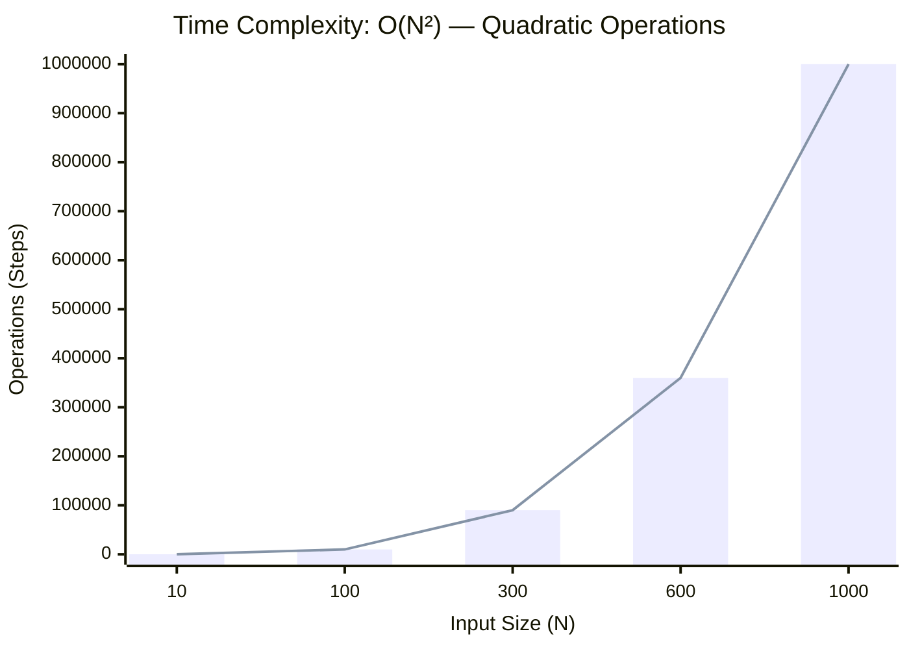
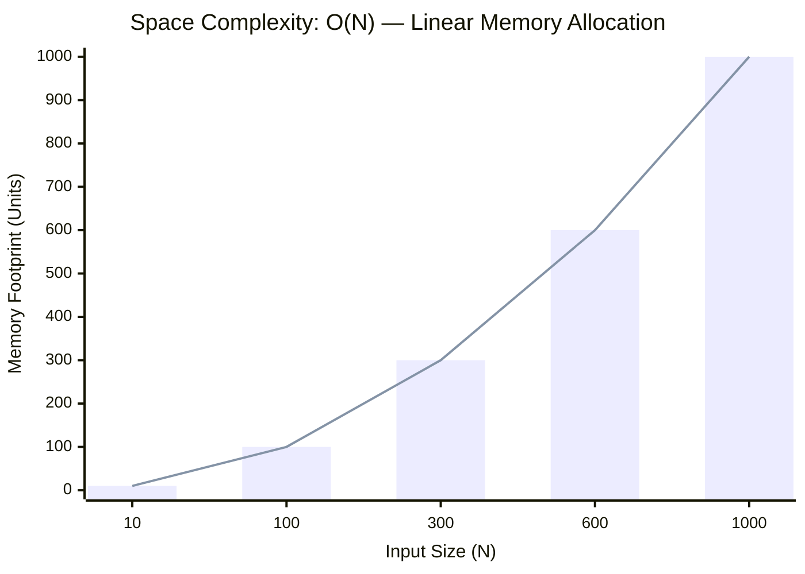

<h2><a href="https://leetcode.com/problems/jump-game-ii/submissions/2160505018/">Jump Game II</a></h2><h3>Medium</h3>

You are given a <strong>0-indexed</strong> array of integers <code>nums</code> of length <code>n</code>. You are initially positioned at&nbsp;index 0.

Each element <code>nums[i]</code> represents the maximum length of a forward jump from index <code>i</code>. In other words, if you are at index <code>i</code>, you can jump to any index <code>(i + j)</code>&nbsp;where:

<ul>
	<li><code>0 &lt;= j &lt;= nums[i]</code> and</li>
	<li><code>i + j &lt; n</code></li>
</ul>

Return <em>the minimum number of jumps to reach index </em><code>n - 1</code>. The test cases are generated such that you can reach index&nbsp;<code>n - 1</code>.

&nbsp;

<strong class="example">Example 1:</strong>

<pre><strong>Input:</strong> nums = [2,3,1,1,4]
<strong>Output:</strong> 2
<strong>Explanation:</strong> The minimum number of jumps to reach the last index is 2. Jump 1 step from index 0 to 1, then 3 steps to the last index.
</pre>

<strong class="example">Example 2:</strong>

<pre><strong>Input:</strong> nums = [2,3,0,1,4]
<strong>Output:</strong> 2
</pre>

&nbsp;

<strong>Constraints:</strong>

<ul>
	<li><code>1 &lt;= nums.length &lt;= 104</code></li>
	<li><code>0 &lt;= nums[i] &lt;= 1000</code></li>
	<li>It's guaranteed that you can reach <code>nums[n - 1]</code>.</li>
</ul>

### 📊 Submission Statistics
- **Language:** `cpp`
- **Runtime:** `0 ms`
- **Memory:** `N/A`
- **Submission Date:** Fri, 02 Oct 2026 19:16:54 GMT

---

### 💡 Approach & Complexity Analysis
#### 🧠 Intuition & Algorithmic Strategy
- **Approach:** Linear scan and greedy state accumulation to resolve **Jump Game II**.
- **Flow:**
  1. Initialize state variables and inspect base constraints.
  2. Iterate through input elements, maintaining current progress and boundaries.
  3. Return the calculated result satisfying problem criteria.

#### ⏱️ Complexity Analysis
- **Time Complexity:** $\mathcal{O}(N^2) \text{ or } \mathcal{O}(N \times M)$ — *Nested iteration processing coordinate pairs, combinations, or 2D matrix grids.*
- **Space Complexity:** $\mathcal{O}(N)$ — *Auxiliary lookup table or dynamically allocated buffer storing input elements.*

#### 📈 Time Complexity Graph (Operations vs Input Size $N$)

#### 📦 Space Complexity Graph (Memory Footprint vs Input Size $N$)

---
*Auto-synced with [LeetGitSyncPro](https://synccode-pro.pages.dev) & [DSATracker](https://dsatracker.in)*
