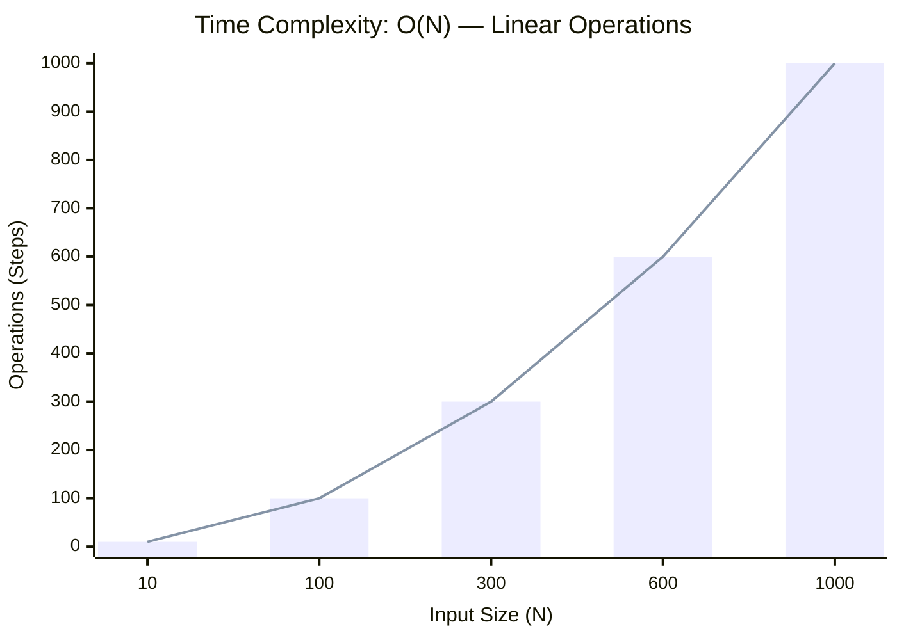

<h2><a href="https://leetcode.com/problems/jump-game/submissions/2160313664/">Jump Game</a></h2><h3>Medium</h3>

You are given an integer array <code>nums</code>. You are initially positioned at the array's <strong>first index</strong>, and each element in the array represents your maximum jump length at that position.

Return <code>true</code><em> if you can reach the last index, or </em><code>false</code><em> otherwise</em>.

&nbsp;

<strong class="example">Example 1:</strong>

<pre><strong>Input:</strong> nums = [2,3,1,1,4]
<strong>Output:</strong> true
<strong>Explanation:</strong> Jump 1 step from index 0 to 1, then 3 steps to the last index.
</pre>

<strong class="example">Example 2:</strong>

<pre><strong>Input:</strong> nums = [3,2,1,0,4]
<strong>Output:</strong> false
<strong>Explanation:</strong> You will always arrive at index 3 no matter what. Its maximum jump length is 0, which makes it impossible to reach the last index.
</pre>

&nbsp;

<strong>Constraints:</strong>

<ul>
	<li><code>1 &lt;= nums.length &lt;= 104</code></li>
	<li><code>0 &lt;= nums[i] &lt;= 105</code></li>
</ul>

### 📊 Submission Statistics
- **Language:** `cpp`
- **Runtime:** `0 ms`
- **Memory:** `N/A`
- **Submission Date:** Fri, 02 Oct 2026 16:02:27 GMT

---

### 💡 Approach & Complexity Analysis
#### 🧠 Intuition & Algorithmic Strategy
- **Approach:** Linear scan and greedy state accumulation to resolve **Jump Game**.
- **Flow:**
  1. Initialize state variables and inspect base constraints.
  2. Iterate through input elements, maintaining current progress and boundaries.
  3. Return the calculated result satisfying problem criteria.

#### ⏱️ Complexity Analysis
- **Time Complexity:** $\mathcal{O}(N)$ — *Single linear pass over the input collection.*
- **Space Complexity:** $\mathcal{O}(N)$ — *Auxiliary lookup table or dynamically allocated buffer storing input elements.*

#### 📈 Time Complexity Graph (Operations vs Input Size $N$)

#### 📦 Space Complexity Graph (Memory Footprint vs Input Size $N$)

---
*Auto-synced with [LeetGitSyncPro](https://synccode-pro.pages.dev) & [DSATracker](https://dsatracker.in)*
