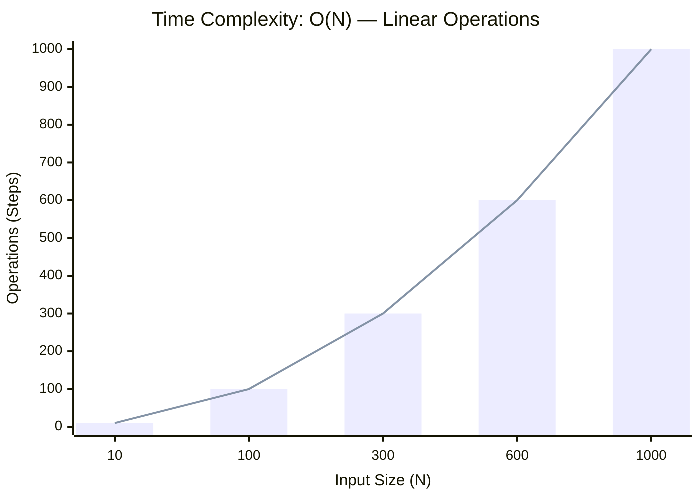

<h2><a href="https://leetcode.com/problems/lemonade-change/submissions/2159156925/">Lemonade Change</a></h2><h3>Easy</h3>

At a lemonade stand, each lemonade costs <code>$5</code>. Customers are standing in a queue to buy from you and order one at a time (in the order specified by bills). Each customer will only buy one lemonade and pay with either a <code>$5</code>, <code>$10</code>, or <code>$20</code> bill. You must provide the correct change to each customer so that the net transaction is that the customer pays <code>$5</code>.

Note that you do not have any change in hand at first.

Given an integer array <code>bills</code> where <code>bills[i]</code> is the bill the <code>ith</code> customer pays, return <code>true</code> <em>if you can provide every customer with the correct change, or</em> <code>false</code> <em>otherwise</em>.

&nbsp;

<strong class="example">Example 1:</strong>

<pre><strong>Input:</strong> bills = [5,5,5,10,20]
<strong>Output:</strong> true
<strong>Explanation:</strong> 
From the first 3 customers, we collect three $5 bills in order.
From the fourth customer, we collect a $10 bill and give back a $5.
From the fifth customer, we give a $10 bill and a $5 bill.
Since all customers got correct change, we output true.
</pre>

<strong class="example">Example 2:</strong>

<pre><strong>Input:</strong> bills = [5,5,10,10,20]
<strong>Output:</strong> false
<strong>Explanation:</strong> 
From the first two customers in order, we collect two $5 bills.
For the next two customers in order, we collect a $10 bill and give back a $5 bill.
For the last customer, we can not give the change of $15 back because we only have two $10 bills.
Since not every customer received the correct change, the answer is false.
</pre>

&nbsp;

<strong>Constraints:</strong>

<ul>
	<li><code>1 &lt;= bills.length &lt;= 105</code></li>
	<li><code>bills[i]</code> is either <code>5</code>, <code>10</code>, or <code>20</code>.</li>
</ul>

### 📊 Submission Statistics
- **Language:** `cpp`
- **Runtime:** `0 ms`
- **Memory:** `N/A`
- **Submission Date:** Thu, 01 Oct 2026 11:48:05 GMT

---

### 💡 Approach & Complexity Analysis
#### 🧠 Intuition & Algorithmic Strategy
- **Approach:** Linear scan and greedy state accumulation to resolve **Lemonade Change**.
- **Flow:**
  1. Initialize state variables and inspect base constraints.
  2. Iterate through input elements, maintaining current progress and boundaries.
  3. Return the calculated result satisfying problem criteria.

#### ⏱️ Complexity Analysis
- **Time Complexity:** $\mathcal{O}(N)$ — *Single linear pass over the input collection.*
- **Space Complexity:** $\mathcal{O}(N)$ — *Auxiliary lookup table or dynamically allocated buffer storing input elements.*

#### 📈 Time Complexity Graph (Operations vs Input Size $N$)

#### 📦 Space Complexity Graph (Memory Footprint vs Input Size $N$)

---
*Auto-synced with [LeetGitSyncPro](https://synccode-pro.pages.dev) & [DSATracker](https://dsatracker.in)*
