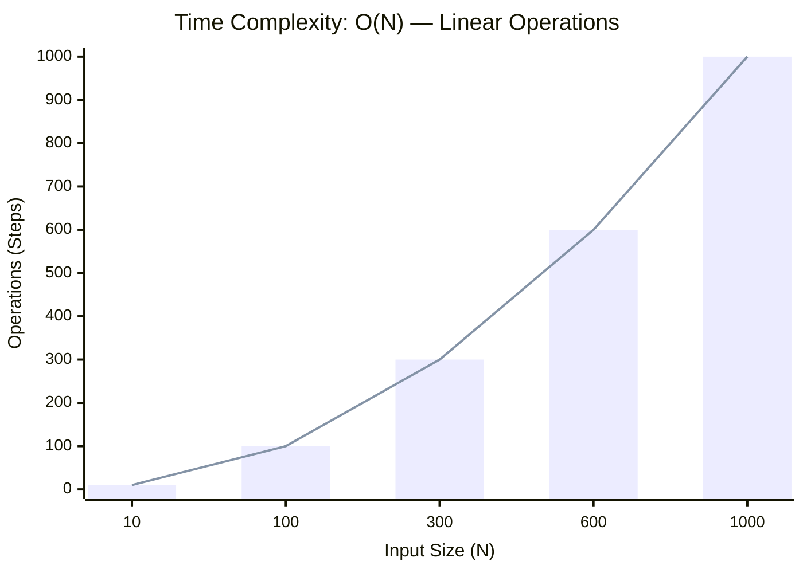
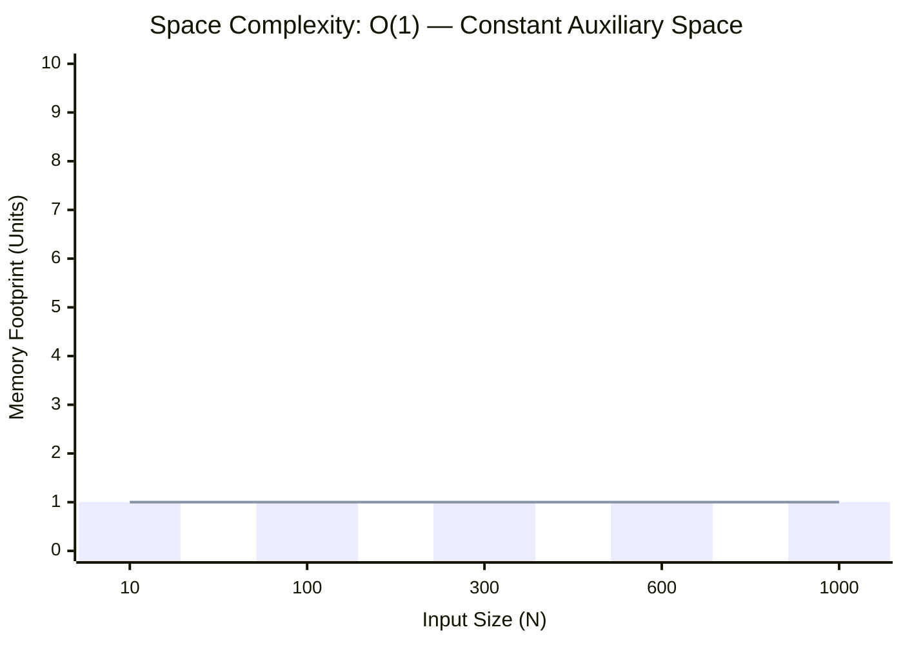

<h2><a href="https://leetcode.com/problems/minimum-bit-flips-to-convert-number/submissions/2168173968/">Minimum Bit Flips to Convert Number</a></h2><h3>Easy</h3>

A <strong>bit flip</strong> of a number <code>x</code> is choosing a bit in the binary representation of <code>x</code> and <strong>flipping</strong> it from either <code>0</code> to <code>1</code> or <code>1</code> to <code>0</code>.

<ul>
	<li>For example, for <code>x = 7</code>, the binary representation is <code>111</code> and we may choose any bit (including any leading zeros not shown) and flip it. We can flip the first bit from the right to get <code>110</code>, flip the second bit from the right to get <code>101</code>, flip the fifth bit from the right (a leading zero) to get <code>10111</code>, etc.</li>
</ul>

Given two integers <code>start</code> and <code>goal</code>, return<em> the <strong>minimum</strong> number of <strong>bit flips</strong> to convert </em><code>start</code><em> to </em><code>goal</code>.

&nbsp;

<strong class="example">Example 1:</strong>

<pre><strong>Input:</strong> start = 10, goal = 7
<strong>Output:</strong> 3
<strong>Explanation:</strong> The binary representation of 10 and 7 are 1010 and 0111 respectively. We can convert 10 to 7 in 3 steps:
- Flip the first bit from the right: 101<u>0</u> -&gt; 101<u>1</u>.
- Flip the third bit from the right: 1<u>0</u>11 -&gt; 1<u>1</u>11.
- Flip the fourth bit from the right: <u>1</u>111 -&gt; <u>0</u>111.
It can be shown we cannot convert 10 to 7 in less than 3 steps. Hence, we return 3.</pre>

<strong class="example">Example 2:</strong>

<pre><strong>Input:</strong> start = 3, goal = 4
<strong>Output:</strong> 3
<strong>Explanation:</strong> The binary representation of 3 and 4 are 011 and 100 respectively. We can convert 3 to 4 in 3 steps:
- Flip the first bit from the right: 01<u>1</u> -&gt; 01<u>0</u>.
- Flip the second bit from the right: 0<u>1</u>0 -&gt; 0<u>0</u>0.
- Flip the third bit from the right: <u>0</u>00 -&gt; <u>1</u>00.
It can be shown we cannot convert 3 to 4 in less than 3 steps. Hence, we return 3.
</pre>

&nbsp;

<strong>Constraints:</strong>

<ul>
	<li><code>0 &lt;= start, goal &lt;= 109</code></li>
</ul>

&nbsp;

<strong>Note:</strong> This question is the same as <a href="https://leetcode.com/problems/hamming-distance/description/" target="_blank">461: Hamming Distance.</a>

### 📊 Submission Statistics
- **Language:** `cpp`
- **Runtime:** `0 ms`
- **Memory:** `N/A`
- **Submission Date:** Sat, 10 Oct 2026 13:25:30 GMT

---

### 💡 Approach & Complexity Analysis
#### 🧠 Intuition & Algorithmic Strategy
- **Approach:** Linear scan and greedy state accumulation to resolve **Minimum Bit Flips to Convert Number**.
- **Flow:**
  1. Initialize state variables and inspect base constraints.
  2. Iterate through input elements, maintaining current progress and boundaries.
  3. Return the calculated result satisfying problem criteria.

#### ⏱️ Complexity Analysis
- **Time Complexity:** $\mathcal{O}(N)$ — *Single linear pass over the input collection.*
- **Space Complexity:** $\mathcal{O}(1)$ — *In-place execution using only a constant number of auxiliary pointer variables.*

#### 📈 Time Complexity Graph (Operations vs Input Size $N$)

#### 📦 Space Complexity Graph (Memory Footprint vs Input Size $N$)

---
*Auto-synced with [LeetGitSyncPro](https://synccode-pro.pages.dev) & [DSATracker](https://dsatracker.in)*
