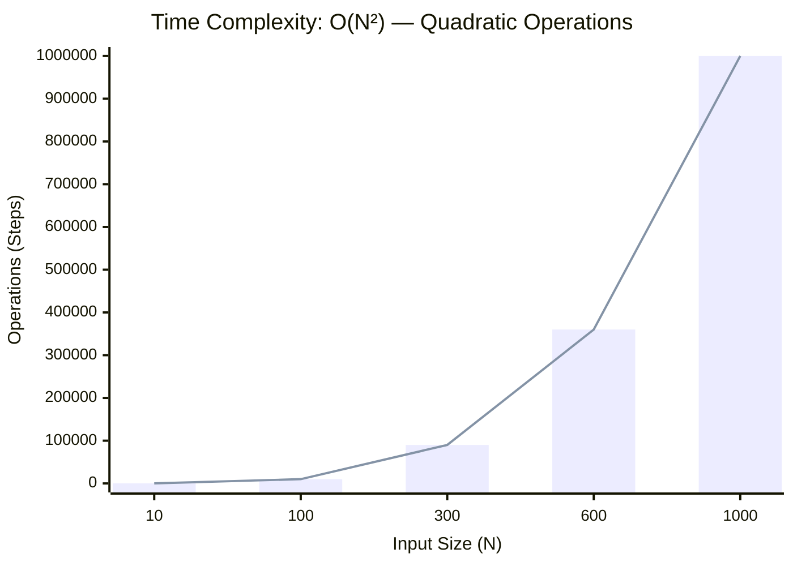
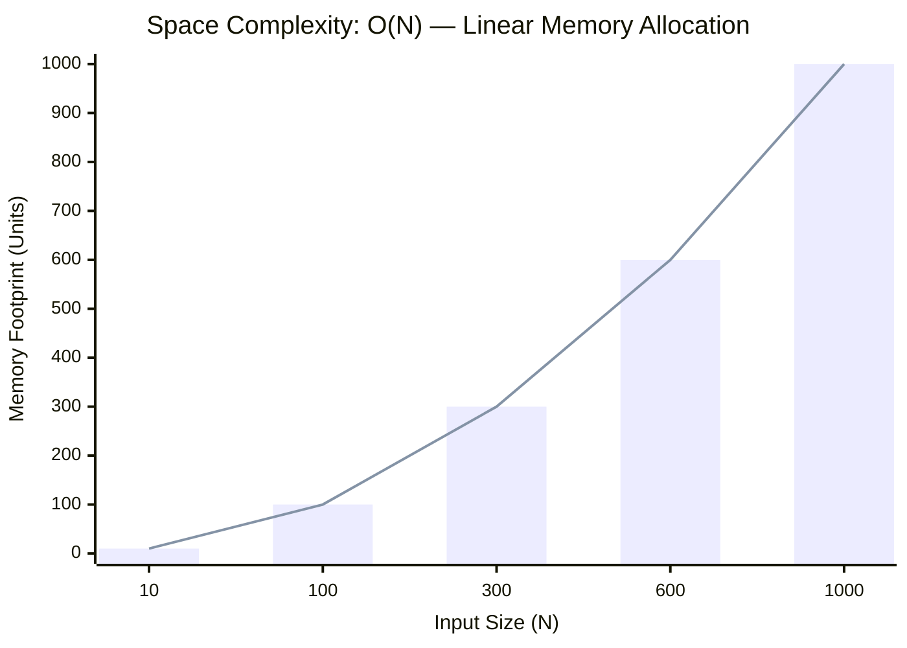

<h2><a href="https://leetcode.com/problems/next-greater-element-i/submissions/2166606694/">Next Greater Element I</a></h2><h3>Easy</h3>

The <strong>next greater element</strong> of some element <code>x</code> in an array is the <strong>first greater</strong> element that is <strong>to the right</strong> of <code>x</code> in the same array.

You are given two <strong>distinct 0-indexed</strong> integer arrays <code>nums1</code> and <code>nums2</code>, where <code>nums1</code> is a subset of <code>nums2</code>.

For each <code>0 &lt;= i &lt; nums1.length</code>, find the index <code>j</code> such that <code>nums1[i] == nums2[j]</code> and determine the <strong>next greater element</strong> of <code>nums2[j]</code> in <code>nums2</code>. If there is no next greater element, then the answer for this query is <code>-1</code>.

Return <em>an array </em><code>ans</code><em> of length </em><code>nums1.length</code><em> such that </em><code>ans[i]</code><em> is the <strong>next greater element</strong> as described above.</em>

&nbsp;

<strong class="example">Example 1:</strong>

<pre><strong>Input:</strong> nums1 = [4,1,2], nums2 = [1,3,4,2]
<strong>Output:</strong> [-1,3,-1]
<strong>Explanation:</strong> The next greater element for each value of nums1 is as follows:
- 4 is underlined in nums2 = [1,3,<u>4</u>,2]. There is no next greater element, so the answer is -1.
- 1 is underlined in nums2 = [<u>1</u>,3,4,2]. The next greater element is 3.
- 2 is underlined in nums2 = [1,3,4,<u>2</u>]. There is no next greater element, so the answer is -1.
</pre>

<strong class="example">Example 2:</strong>

<pre><strong>Input:</strong> nums1 = [2,4], nums2 = [1,2,3,4]
<strong>Output:</strong> [3,-1]
<strong>Explanation:</strong> The next greater element for each value of nums1 is as follows:
- 2 is underlined in nums2 = [1,<u>2</u>,3,4]. The next greater element is 3.
- 4 is underlined in nums2 = [1,2,3,<u>4</u>]. There is no next greater element, so the answer is -1.
</pre>

&nbsp;

<strong>Constraints:</strong>

<ul>
	<li><code>1 &lt;= nums1.length &lt;= nums2.length &lt;= 1000</code></li>
	<li><code>0 &lt;= nums1[i], nums2[i] &lt;= 104</code></li>
	<li>All integers in <code>nums1</code> and <code>nums2</code> are <strong>unique</strong>.</li>
	<li>All the integers of <code>nums1</code> also appear in <code>nums2</code>.</li>
</ul>

&nbsp;

<strong>Follow up:</strong> Could you find an <code>O(nums1.length + nums2.length)</code> solution?

### 📊 Submission Statistics
- **Language:** `cpp`
- **Runtime:** `0 ms`
- **Memory:** `N/A`
- **Submission Date:** Thu, 08 Oct 2026 17:42:19 GMT

---

### 💡 Approach & Complexity Analysis
#### 🧠 Intuition & Algorithmic Strategy
- **Approach:** Utilizes frequency counting or presence tracking via hash mapping for O(1) membership queries.
- **Flow:**
  1. Initialize state variables and inspect base constraints.
  2. Iterate through input elements, maintaining current progress and boundaries.
  3. Return the calculated result satisfying problem criteria.

#### ⏱️ Complexity Analysis
- **Time Complexity:** $\mathcal{O}(N^2) \text{ or } \mathcal{O}(N \times M)$ — *Nested iteration processing coordinate pairs, combinations, or 2D matrix grids.*
- **Space Complexity:** $\mathcal{O}(N)$ — *Auxiliary lookup table or dynamically allocated buffer storing input elements.*

#### 📈 Time Complexity Graph (Operations vs Input Size $N$)

#### 📦 Space Complexity Graph (Memory Footprint vs Input Size $N$)

---
*Auto-synced with [LeetGitSyncPro](https://synccode-pro.pages.dev) & [DSATracker](https://dsatracker.in)*
