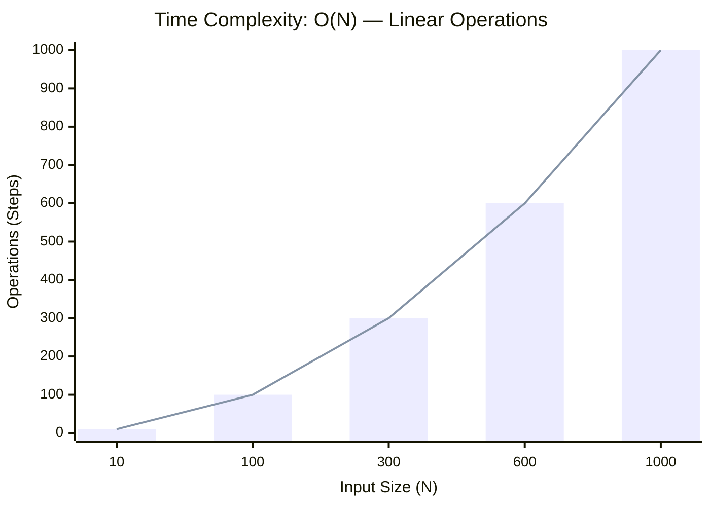
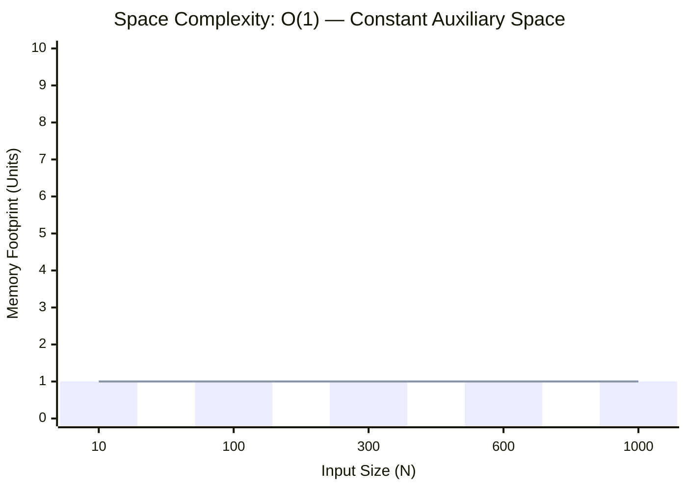

<h2><a href="https://leetcode.com/problems/number-of-1-bits/submissions/2160517728/">Number of 1 Bits</a></h2><h3>Easy</h3>

Given a positive integer <code>n</code>, write a function that returns the number of set bits in its binary representation (also known as the <a href="http://en.wikipedia.org/wiki/Hamming_weight" target="_blank">Hamming weight</a>).

&nbsp;

<strong class="example">Example 1:</strong>

<strong>Input:</strong> n = 11

<strong>Output:</strong> 3

<strong>Explanation:</strong>

The input binary string <strong>1011</strong> has a total of three set bits.

<strong class="example">Example 2:</strong>

<strong>Input:</strong> n = 128

<strong>Output:</strong> 1

<strong>Explanation:</strong>

The input binary string <strong>10000000</strong> has a total of one set bit.

<strong class="example">Example 3:</strong>

<strong>Input:</strong> n = 2147483645

<strong>Output:</strong> 30

<strong>Explanation:</strong>

The input binary string <strong>1111111111111111111111111111101</strong> has a total of thirty set bits.

&nbsp;

<strong>Constraints:</strong>

<ul>
	<li><code>1 &lt;= n &lt;= 231 - 1</code></li>
</ul>

&nbsp;

<strong>Follow up:</strong> If this function is called many times, how would you optimize it?

### 📊 Submission Statistics
- **Language:** `cpp`
- **Runtime:** `0 ms`
- **Memory:** `N/A`
- **Submission Date:** Fri, 02 Oct 2026 19:37:12 GMT

---

### 💡 Approach & Complexity Analysis
#### 🧠 Intuition & Algorithmic Strategy
- **Approach:** Linear scan and greedy state accumulation to resolve **Number of 1 Bits**.
- **Flow:**
  1. Initialize state variables and inspect base constraints.
  2. Iterate through input elements, maintaining current progress and boundaries.
  3. Return the calculated result satisfying problem criteria.

#### ⏱️ Complexity Analysis
- **Time Complexity:** $\mathcal{O}(N)$ — *Single linear pass over the input collection.*
- **Space Complexity:** $\mathcal{O}(1)$ — *In-place execution using only a constant number of auxiliary pointer variables.*

#### 📈 Time Complexity Graph (Operations vs Input Size $N$)

#### 📦 Space Complexity Graph (Memory Footprint vs Input Size $N$)

---
*Auto-synced with [LeetGitSyncPro](https://synccode-pro.pages.dev) & [DSATracker](https://dsatracker.in)*
