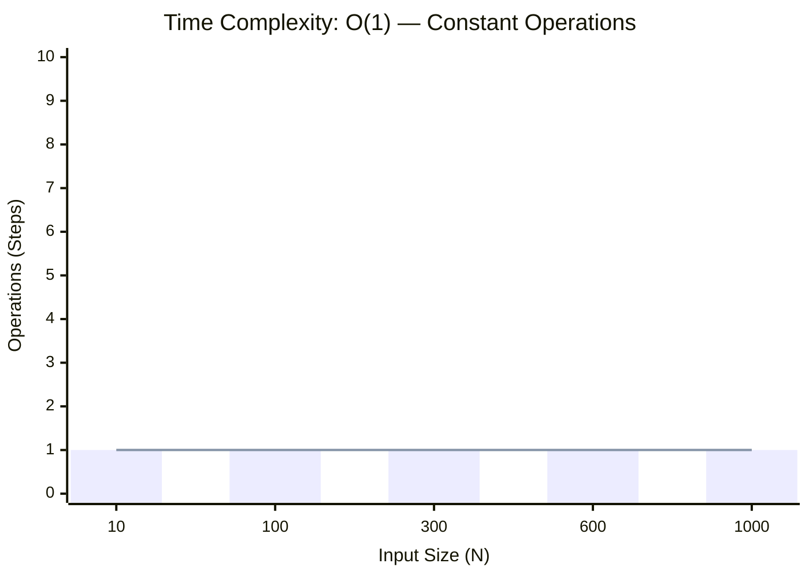
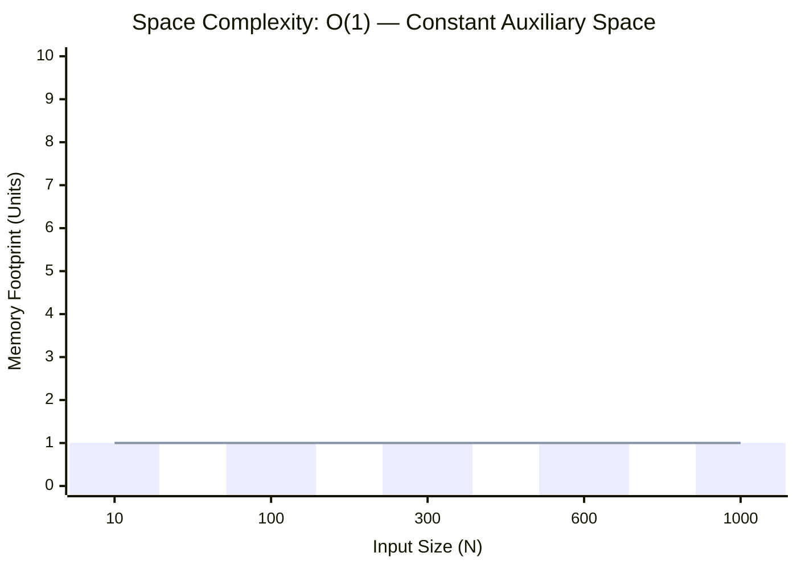

<h2><a href="https://leetcode.com/problems/power-of-two/submissions/2160523232/">Power of Two</a></h2><h3>Easy</h3>

Given an integer <code>n</code>, return <em><code>true</code> if it is a power of two. Otherwise, return <code>false</code></em>.

An integer <code>n</code> is a power of two, if there exists an integer <code>x</code> such that <code>n == 2x</code>.

&nbsp;

<strong class="example">Example 1:</strong>

<pre><strong>Input:</strong> n = 1
<strong>Output:</strong> true
<strong>Explanation: </strong>20 = 1
</pre>

<strong class="example">Example 2:</strong>

<pre><strong>Input:</strong> n = 16
<strong>Output:</strong> true
<strong>Explanation: </strong>24 = 16
</pre>

<strong class="example">Example 3:</strong>

<pre><strong>Input:</strong> n = 3
<strong>Output:</strong> false
</pre>

&nbsp;

<strong>Constraints:</strong>

<ul>
	<li><code>-231 &lt;= n &lt;= 231 - 1</code></li>
</ul>

&nbsp;

<strong>Follow up:</strong> Could you solve it without loops/recursion?

### 📊 Submission Statistics
- **Language:** `cpp`
- **Runtime:** `0 ms`
- **Memory:** `N/A`
- **Submission Date:** Fri, 02 Oct 2026 19:46:33 GMT

---

### 💡 Approach & Complexity Analysis
#### 🧠 Intuition & Algorithmic Strategy
- **Approach:** Direct constant-time evaluation using bit manipulation, formulas, or branchless operations.
- **Flow:**
  1. Initialize state variables and inspect base constraints.
  2. Iterate through input elements, maintaining current progress and boundaries.
  3. Return the calculated result satisfying problem criteria.

#### ⏱️ Complexity Analysis
- **Time Complexity:** $\mathcal{O}(1)$ — *Constant time operations with direct arithmetic or state manipulation.*
- **Space Complexity:** $\mathcal{O}(1)$ — *In-place execution using only a constant number of auxiliary pointer variables.*

#### 📈 Time Complexity Graph (Operations vs Input Size $N$)

#### 📦 Space Complexity Graph (Memory Footprint vs Input Size $N$)

---
*Auto-synced with [LeetGitSyncPro](https://synccode-pro.pages.dev) & [DSATracker](https://dsatracker.in)*
