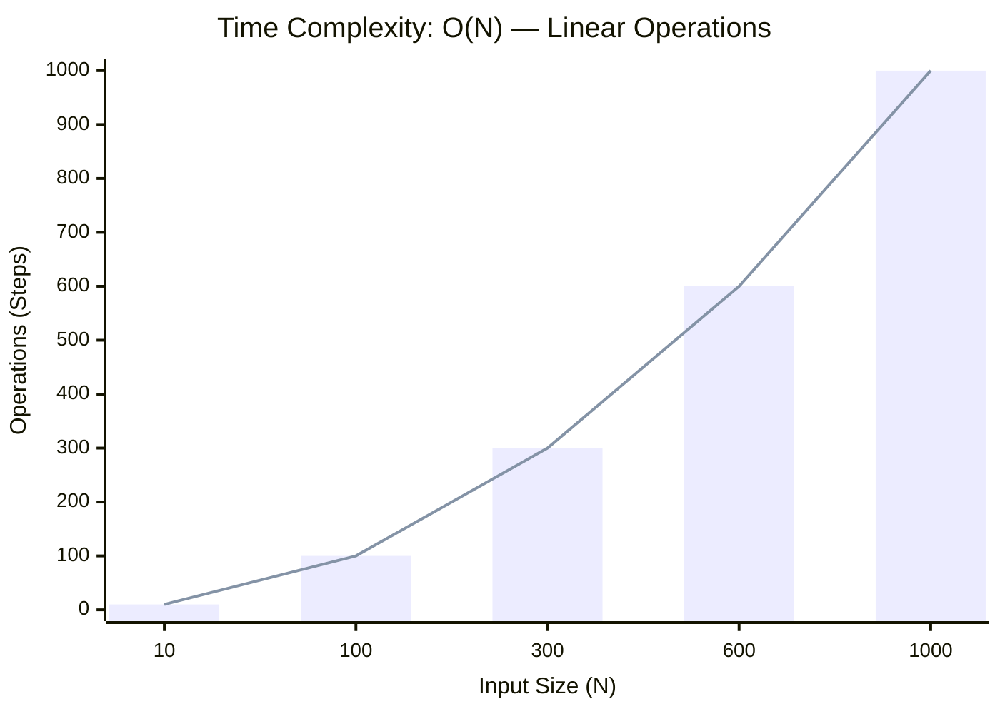
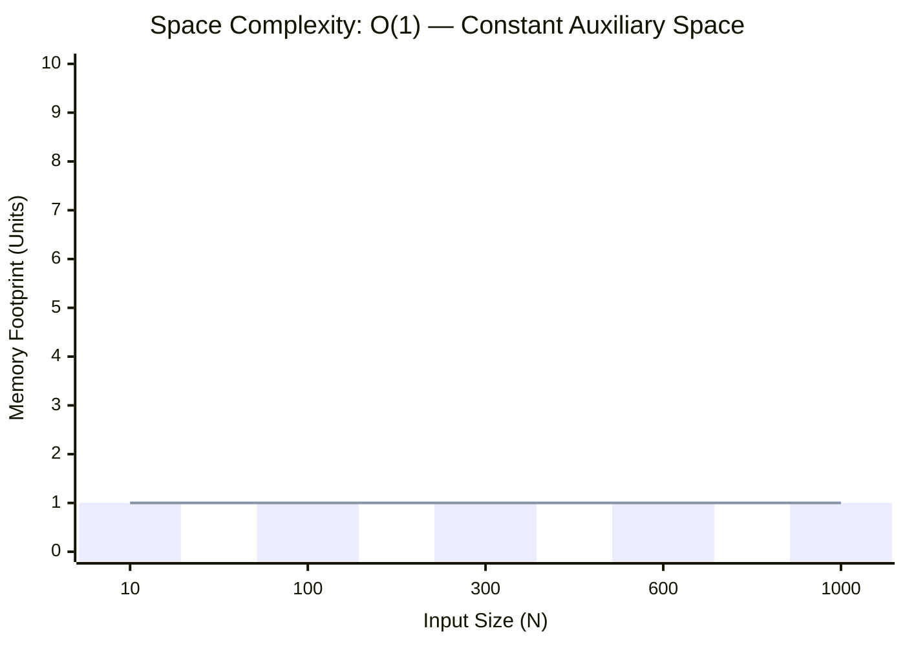

<h2><a href="https://leetcode.com/problems/powx-n/submissions/2165035692/">Pow(x, n)</a></h2><h3>Medium</h3>

Implement <a href="http://www.cplusplus.com/reference/valarray/pow/" target="_blank">pow(x, n)</a>, which calculates <code>x</code> raised to the power <code>n</code> (i.e., <code>xn</code>).

&nbsp;

<strong class="example">Example 1:</strong>

<pre><strong>Input:</strong> x = 2.00000, n = 10
<strong>Output:</strong> 1024.00000
</pre>

<strong class="example">Example 2:</strong>

<pre><strong>Input:</strong> x = 2.10000, n = 3
<strong>Output:</strong> 9.26100
</pre>

<strong class="example">Example 3:</strong>

<pre><strong>Input:</strong> x = 2.00000, n = -2
<strong>Output:</strong> 0.25000
<strong>Explanation:</strong> 2-2 = 1/22 = 1/4 = 0.25
</pre>

&nbsp;

<strong>Constraints:</strong>

<ul>
	<li><code>-100.0 &lt; x &lt; 100.0</code></li>
	<li><code>-231 &lt;= n &lt;= 231-1</code></li>
	<li><code>n</code> is an integer.</li>
	<li>Either <code>x</code> is not zero or <code>n &gt; 0</code>.</li>
	<li><code>-104 &lt;= xn &lt;= 104</code></li>
</ul>

### 📊 Submission Statistics
- **Language:** `cpp`
- **Runtime:** `0 ms`
- **Memory:** `N/A`
- **Submission Date:** Wed, 07 Oct 2026 07:17:37 GMT

---

### 💡 Approach & Complexity Analysis
#### 🧠 Intuition & Algorithmic Strategy
- **Approach:** Linear scan and greedy state accumulation to resolve **Pow(x, n)**.
- **Flow:**
  1. Initialize state variables and inspect base constraints.
  2. Iterate through input elements, maintaining current progress and boundaries.
  3. Return the calculated result satisfying problem criteria.

#### ⏱️ Complexity Analysis
- **Time Complexity:** $\mathcal{O}(N)$ — *Single linear pass over the input collection.*
- **Space Complexity:** $\mathcal{O}(1)$ — *In-place execution using only a constant number of auxiliary pointer variables.*

#### 📈 Time Complexity Graph (Operations vs Input Size $N$)

#### 📦 Space Complexity Graph (Memory Footprint vs Input Size $N$)

---
*Auto-synced with [LeetGitSyncPro](https://synccode-pro.pages.dev) & [DSATracker](https://dsatracker.in)*
