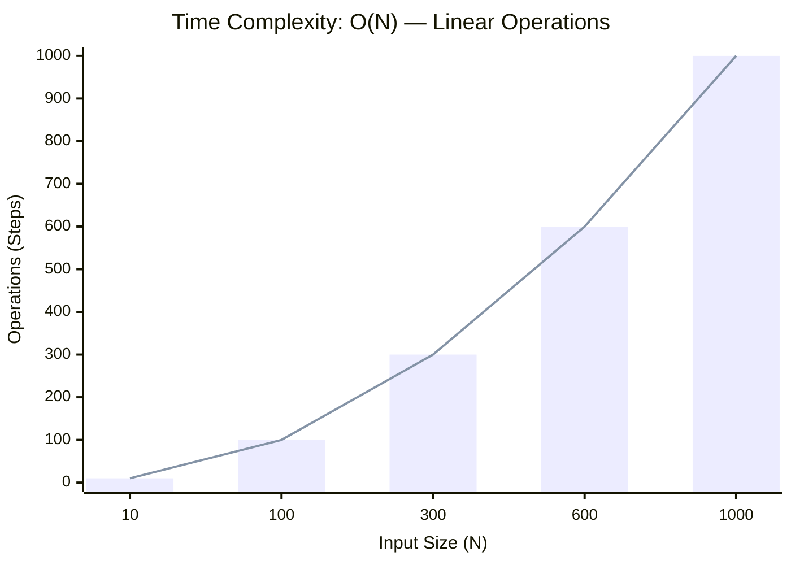

<h2><a href="https://leetcode.com/problems/rank-transform-of-an-array/submissions/2162328108/">Rank Transform of an Array</a></h2><h3>Easy</h3>

Given an array of integers&nbsp;<code>arr</code>, replace each element with its rank.

The rank represents how large the element is. The rank has the following rules:

<ul>
	<li>Rank is an integer starting from 1.</li>
	<li>The larger the element, the larger the rank. If two elements are equal, their rank must be the same.</li>
	<li>Rank should be as small as possible.</li>
</ul>

&nbsp;

<strong class="example">Example 1:</strong>

<pre><strong>Input:</strong> arr = [40,10,20,30]
<strong>Output:</strong> [4,1,2,3]
<strong>Explanation</strong>: 40 is the largest element. 10 is the smallest. 20 is the second smallest. 30 is the third smallest.</pre>

<strong class="example">Example 2:</strong>

<pre><strong>Input:</strong> arr = [100,100,100]
<strong>Output:</strong> [1,1,1]
<strong>Explanation</strong>: Same elements share the same rank.
</pre>

<strong class="example">Example 3:</strong>

<pre><strong>Input:</strong> arr = [37,12,28,9,100,56,80,5,12]
<strong>Output:</strong> [5,3,4,2,8,6,7,1,3]
</pre>

&nbsp;

<strong>Constraints:</strong>

<ul>
	<li><code>0 &lt;= arr.length &lt;= 105</code></li>
	<li><code>-109&nbsp;&lt;= arr[i] &lt;= 109</code></li>
</ul>

### 📊 Submission Statistics
- **Language:** `cpp`
- **Runtime:** `0 ms`
- **Memory:** `N/A`
- **Submission Date:** Sun, 04 Oct 2026 16:50:01 GMT

---

### 💡 Approach & Complexity Analysis
#### 🧠 Intuition & Algorithmic Strategy
- **Approach:** Utilizes frequency counting or presence tracking via hash mapping for O(1) membership queries.
- **Flow:**
  1. Initialize state variables and inspect base constraints.
  2. Iterate through input elements, maintaining current progress and boundaries.
  3. Return the calculated result satisfying problem criteria.

#### ⏱️ Complexity Analysis
- **Time Complexity:** $\mathcal{O}(N)$ — *Single linear pass over the input collection.*
- **Space Complexity:** $\mathcal{O}(N)$ — *Auxiliary lookup table or dynamically allocated buffer storing input elements.*

#### 📈 Time Complexity Graph (Operations vs Input Size $N$)

#### 📦 Space Complexity Graph (Memory Footprint vs Input Size $N$)

---
*Auto-synced with [LeetGitSyncPro](https://synccode-pro.pages.dev) & [DSATracker](https://dsatracker.in)*
