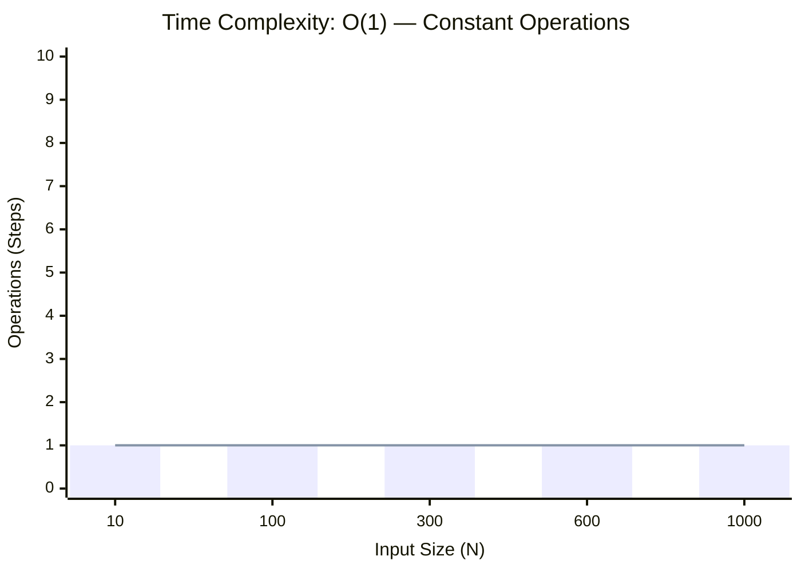
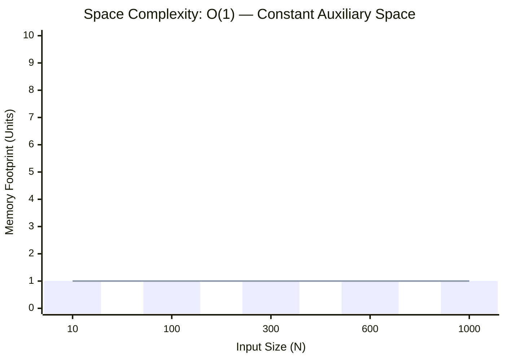

<h2><a href="https://leetcode.com/problems/rotate-array/">Rotate Array</a></h2><h3>Medium</h3>

Given an integer array <code>nums</code>, rotate the array to the right by <code>k</code> steps, where <code>k</code> is non-negative.

&nbsp;

<strong class="example">Example 1:</strong>

<pre><strong>Input:</strong> nums = [1,2,3,4,5,6,7], k = 3
<strong>Output:</strong> [5,6,7,1,2,3,4]
<strong>Explanation:</strong>
rotate 1 steps to the right: [7,1,2,3,4,5,6]
rotate 2 steps to the right: [6,7,1,2,3,4,5]
rotate 3 steps to the right: [5,6,7,1,2,3,4]
</pre>

<strong class="example">Example 2:</strong>

<pre><strong>Input:</strong> nums = [-1,-100,3,99], k = 2
<strong>Output:</strong> [3,99,-1,-100]
<strong>Explanation:</strong> 
rotate 1 steps to the right: [99,-1,-100,3]
rotate 2 steps to the right: [3,99,-1,-100]
</pre>

&nbsp;

<strong>Constraints:</strong>

<ul>
	<li><code>1 &lt;= nums.length &lt;= 105</code></li>
	<li><code>-231 &lt;= nums[i] &lt;= 231 - 1</code></li>
	<li><code>0 &lt;= k &lt;= 105</code></li>
</ul>

&nbsp;

<strong>Follow up:</strong>

<ul>
	<li>Try to come up with as many solutions as you can. There are at least <strong>three</strong> different ways to solve this problem.</li>
	<li>Could you do it in-place with <code>O(1)</code> extra space?</li>
</ul>

### 📊 Submission Statistics
- **Language:** `cpp`
- **Runtime:** `0 ms`
- **Memory:** `N/A`
- **Submission Date:** Wed, 30 Sep 2026 10:37:08 GMT

---

### 💡 Approach & Complexity Analysis
#### 🧠 Intuition & Algorithmic Strategy
- **Approach:** Direct constant-time evaluation using bit manipulation, formulas, or branchless operations.
- **Flow:**
  1. Initialize state variables and inspect base constraints.
  2. Iterate through input elements, maintaining current progress and boundaries.
  3. Return the calculated result satisfying problem criteria.

#### ⏱️ Complexity Analysis
- **Time Complexity:** $\mathcal{O}(1)$ — *Constant time operations with direct arithmetic or state manipulation.*
- **Space Complexity:** $\mathcal{O}(1)$ — *In-place execution using only a constant number of auxiliary pointer variables.*

#### 📈 Time Complexity Graph (Operations vs Input Size $N$)

#### 📦 Space Complexity Graph (Memory Footprint vs Input Size $N$)

---
*Auto-synced with [LeetGitSyncPro](https://synccode-pro.pages.dev) & [DSATracker](https://dsatracker.in)*
