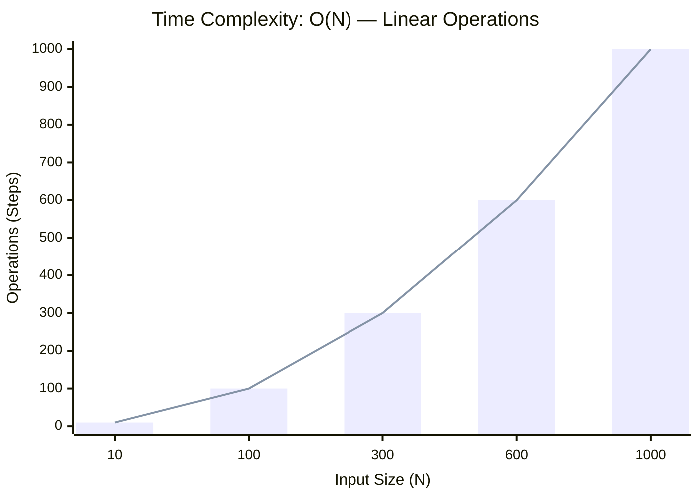

<h2><a href="https://leetcode.com/problems/single-number/submissions/2167499030/">Single Number</a></h2><h3>Easy</h3>

Given a <strong>non-empty</strong>&nbsp;array of integers <code>nums</code>, every element appears <em>twice</em> except for one. Find that single one.

You must&nbsp;implement a solution with a linear runtime complexity and use&nbsp;only constant&nbsp;extra space.

&nbsp;

<strong class="example">Example 1:</strong>

<strong>Input:</strong> nums = [2,2,1]

<strong>Output:</strong> 1

<strong class="example">Example 2:</strong>

<strong>Input:</strong> nums = [4,1,2,1,2]

<strong>Output:</strong> 4

<strong class="example">Example 3:</strong>

<strong>Input:</strong> nums = [1]

<strong>Output:</strong> 1

&nbsp;

<strong>Constraints:</strong>

<ul>
	<li><code>1 &lt;= nums.length &lt;= 3 * 104</code></li>
	<li><code>-3 * 104 &lt;= nums[i] &lt;= 3 * 104</code></li>
	<li>Each element in the array appears twice except for one element which appears only once.</li>
</ul>

### 📊 Submission Statistics
- **Language:** `cpp`
- **Runtime:** `0 ms`
- **Memory:** `N/A`
- **Submission Date:** Fri, 09 Oct 2026 17:01:19 GMT

---

### 💡 Approach & Complexity Analysis
#### 🧠 Intuition & Algorithmic Strategy
- **Approach:** Linear scan and greedy state accumulation to resolve **Single Number**.
- **Flow:**
  1. Initialize state variables and inspect base constraints.
  2. Iterate through input elements, maintaining current progress and boundaries.
  3. Return the calculated result satisfying problem criteria.

#### ⏱️ Complexity Analysis
- **Time Complexity:** $\mathcal{O}(N)$ — *Single linear pass over the input collection.*
- **Space Complexity:** $\mathcal{O}(N)$ — *Auxiliary lookup table or dynamically allocated buffer storing input elements.*

#### 📈 Time Complexity Graph (Operations vs Input Size $N$)

#### 📦 Space Complexity Graph (Memory Footprint vs Input Size $N$)

---
*Auto-synced with [LeetGitSyncPro](https://synccode-pro.pages.dev) & [DSATracker](https://dsatracker.in)*
