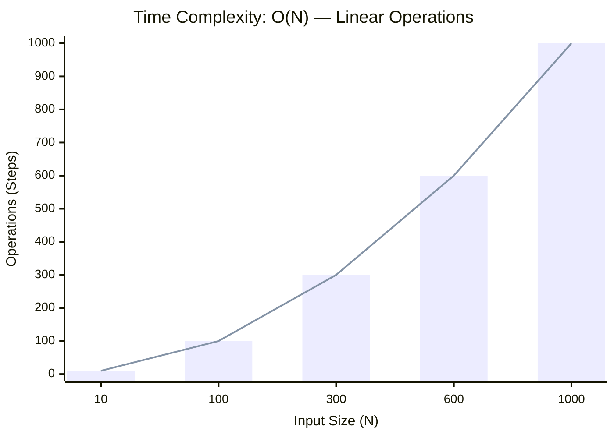
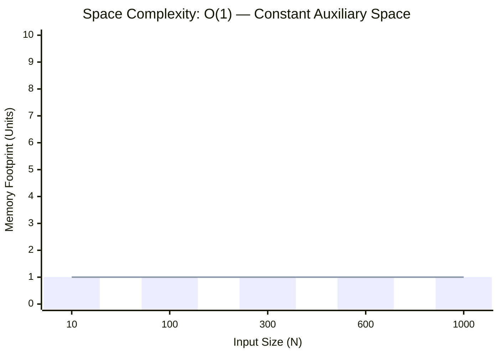

<h2><a href="https://leetcode.com/problems/string-to-integer-atoi/submissions/2164566435/">String to Integer (atoi)</a></h2><h3>Medium</h3>

Implement the <code>myAtoi(string s)</code> function, which converts a string to a 32-bit signed integer.

The algorithm for <code>myAtoi(string s)</code> is as follows:

<ol>
	<li><strong>Whitespace</strong>: Ignore any leading whitespace (<code>" "</code>).</li>
	<li><strong>Signedness</strong>: Determine the sign by checking if the next character is <code>'-'</code> or <code>'+'</code>, assuming positivity if neither present.</li>
	<li><strong>Conversion</strong>: Read the integer by skipping leading zeros until a non-digit character is encountered or the end of the string is reached. If no digits were read, then the result is 0.</li>
	<li><strong>Rounding</strong>: If the integer is out of the 32-bit signed integer range <code>[-231, 231 - 1]</code>, then round the integer to remain in the range. Specifically, integers less than <code>-231</code> should be rounded to <code>-231</code>, and integers greater than <code>231 - 1</code> should be rounded to <code>231 - 1</code>.</li>
</ol>

Return the integer as the final result.

<strong>Note:</strong>​​​​​​​ You must not use any built-in library function that converts a string to a number (for example, <code>atoi</code>, <code>stoi</code>, <code>Integer.parseInt</code>, <code>int()</code>, <code>parseInt</code>, <code>Number()</code>). Perform the conversion manually.

&nbsp;

<strong class="example">Example 1:</strong>

<strong>Input:</strong> s = "42"

<strong>Output:</strong> 42

<strong>Explanation:</strong>

<pre>The underlined characters are what is read in and the caret is the current reader position.
Step 1: "42" (no characters read because there is no leading whitespace)
         ^
Step 2: "42" (no characters read because there is neither a '-' nor '+')
         ^
Step 3: "<u>42</u>" ("42" is read in)
           ^
</pre>

<strong class="example">Example 2:</strong>

<strong>Input:</strong> s = " -042"

<strong>Output:</strong> -42

<strong>Explanation:</strong>

<pre>Step 1: "<u>   </u>-042" (leading whitespace is read and ignored)
            ^
Step 2: "   <u>-</u>042" ('-' is read, so the result should be negative)
             ^
Step 3: "   -<u>042</u>" ("042" is read in, leading zeros ignored in the result)
               ^
</pre>

<strong class="example">Example 3:</strong>

<strong>Input:</strong> s = "1337c0d3"

<strong>Output:</strong> 1337

<strong>Explanation:</strong>

<pre>Step 1: "1337c0d3" (no characters read because there is no leading whitespace)
         ^
Step 2: "1337c0d3" (no characters read because there is neither a '-' nor '+')
         ^
Step 3: "<u>1337</u>c0d3" ("1337" is read in; reading stops because the next character is a non-digit)
             ^
</pre>

<strong class="example">Example 4:</strong>

<strong>Input:</strong> s = "0-1"

<strong>Output:</strong> 0

<strong>Explanation:</strong>

<pre>Step 1: "0-1" (no characters read because there is no leading whitespace)
         ^
Step 2: "0-1" (no characters read because there is neither a '-' nor '+')
         ^
Step 3: "<u>0</u>-1" ("0" is read in; reading stops because the next character is a non-digit)
          ^
</pre>

<strong class="example">Example 5:</strong>

<strong>Input:</strong> s = "words and 987"

<strong>Output:</strong> 0

<strong>Explanation:</strong>

Reading stops at the first non-digit character 'w'.

&nbsp;

<strong>Constraints:</strong>

<ul>
	<li><code>0 &lt;= s.length &lt;= 200</code></li>
	<li><code>s</code> consists of English letters (lower-case and upper-case), digits (<code>0 - 9</code>), <code>' '</code>, <code>'+'</code>, <code>'-'</code>, and <code>'.'</code>.</li>
</ul>

### 📊 Submission Statistics
- **Language:** `cpp`
- **Runtime:** `0 ms`
- **Memory:** `N/A`
- **Submission Date:** Tue, 06 Oct 2026 17:53:32 GMT

---

### 💡 Approach & Complexity Analysis
#### 🧠 Intuition & Algorithmic Strategy
- **Approach:** Linear scan and greedy state accumulation to resolve **String to Integer (atoi)**.
- **Flow:**
  1. Initialize state variables and inspect base constraints.
  2. Iterate through input elements, maintaining current progress and boundaries.
  3. Return the calculated result satisfying problem criteria.

#### ⏱️ Complexity Analysis
- **Time Complexity:** $\mathcal{O}(N)$ — *Single linear pass over the input collection.*
- **Space Complexity:** $\mathcal{O}(1)$ — *In-place execution using only a constant number of auxiliary pointer variables.*

#### 📈 Time Complexity Graph (Operations vs Input Size $N$)

#### 📦 Space Complexity Graph (Memory Footprint vs Input Size $N$)

---
*Auto-synced with [LeetGitSyncPro](https://synccode-pro.pages.dev) & [DSATracker](https://dsatracker.in)*
