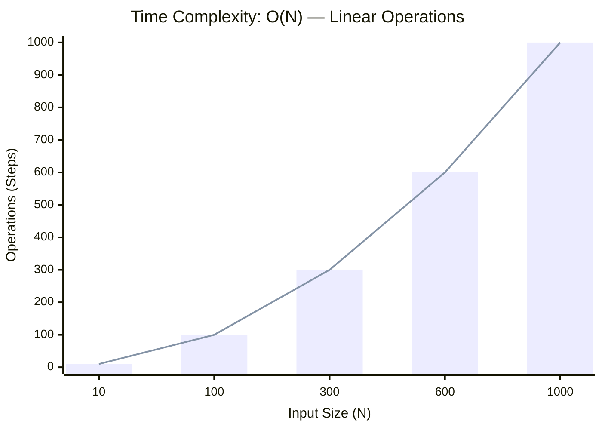
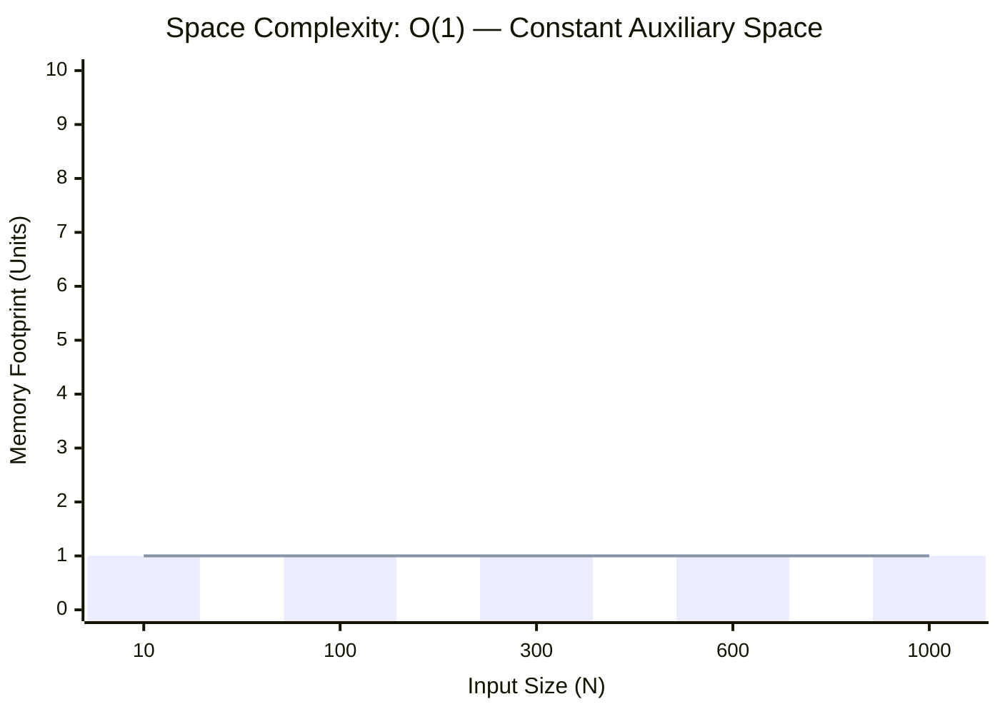

<h2><a href="https://leetcode.com/problems/valid-parenthesis-string/submissions/2159521980/">Valid Parenthesis String</a></h2><h3>Medium</h3>

Given a string <code>s</code> containing only three types of characters: <code>'('</code>, <code>')'</code> and <code>'*'</code>, return <code>true</code> <em>if</em> <code>s</code> <em>is <strong>valid</strong></em>.

The following rules define a <strong>valid</strong> string:

<ul>
	<li>Any left parenthesis <code>'('</code> must have a corresponding right parenthesis <code>')'</code>.</li>
	<li>Any right parenthesis <code>')'</code> must have a corresponding left parenthesis <code>'('</code>.</li>
	<li>Left parenthesis <code>'('</code> must go before the corresponding right parenthesis <code>')'</code>.</li>
	<li><code>'*'</code> could be treated as a single right parenthesis <code>')'</code> or a single left parenthesis <code>'('</code> or an empty string <code>""</code>.</li>
</ul>

&nbsp;

<strong class="example">Example 1:</strong>

<pre><strong>Input:</strong> s = "()"
<strong>Output:</strong> true
</pre>

<strong class="example">Example 2:</strong>

<pre><strong>Input:</strong> s = "(*)"
<strong>Output:</strong> true
</pre>

<strong class="example">Example 3:</strong>

<pre><strong>Input:</strong> s = "(*))"
<strong>Output:</strong> true
</pre>

<strong class="example">Example 4:</strong>

<pre><strong>Input:</strong> s = "("
<strong>Output:</strong> false
</pre>

&nbsp;

<strong>Constraints:</strong>

<ul>
	<li><code>1 &lt;= s.length &lt;= 100</code></li>
	<li><code>s[i]</code> is <code>'('</code>, <code>')'</code> or <code>'*'</code>.</li>
</ul>

### 📊 Submission Statistics
- **Language:** `cpp`
- **Runtime:** `0 ms`
- **Memory:** `N/A`
- **Submission Date:** Thu, 01 Oct 2026 18:24:54 GMT

---

### 💡 Approach & Complexity Analysis
#### 🧠 Intuition & Algorithmic Strategy
- **Approach:** Linear scan and greedy state accumulation to resolve **Valid Parenthesis String**.
- **Flow:**
  1. Initialize state variables and inspect base constraints.
  2. Iterate through input elements, maintaining current progress and boundaries.
  3. Return the calculated result satisfying problem criteria.

#### ⏱️ Complexity Analysis
- **Time Complexity:** $\mathcal{O}(N)$ — *Single linear pass over the input collection.*
- **Space Complexity:** $\mathcal{O}(1)$ — *In-place execution using only a constant number of auxiliary pointer variables.*

#### 📈 Time Complexity Graph (Operations vs Input Size $N$)

#### 📦 Space Complexity Graph (Memory Footprint vs Input Size $N$)

---
*Auto-synced with [LeetGitSyncPro](https://synccode-pro.pages.dev) & [DSATracker](https://dsatracker.in)*
